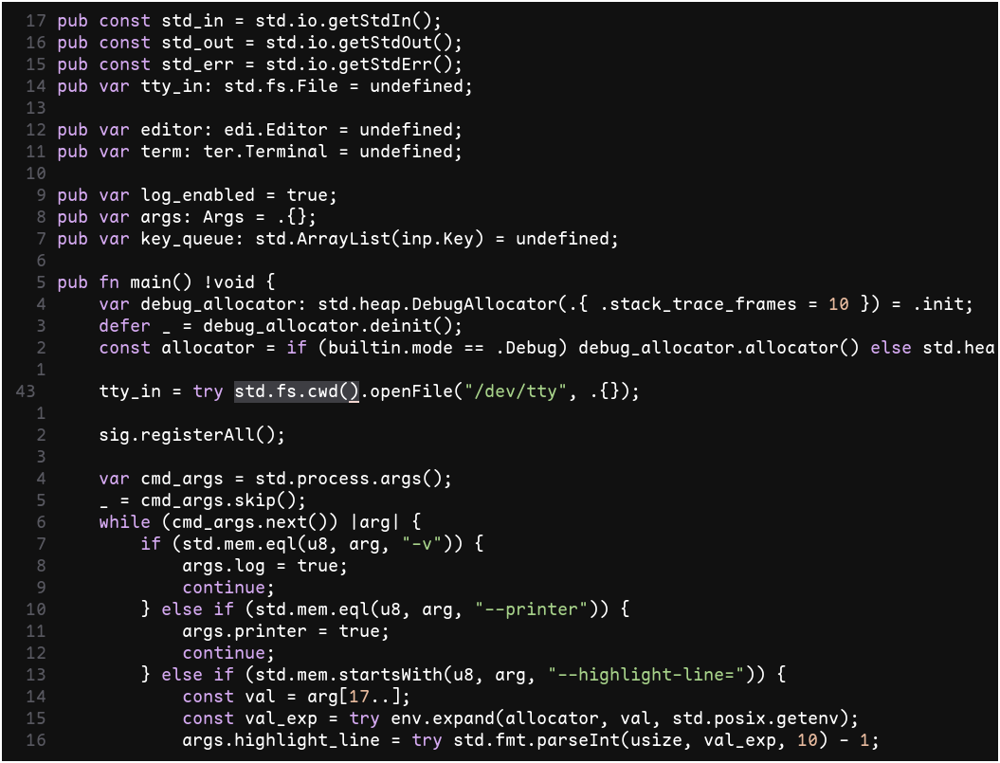
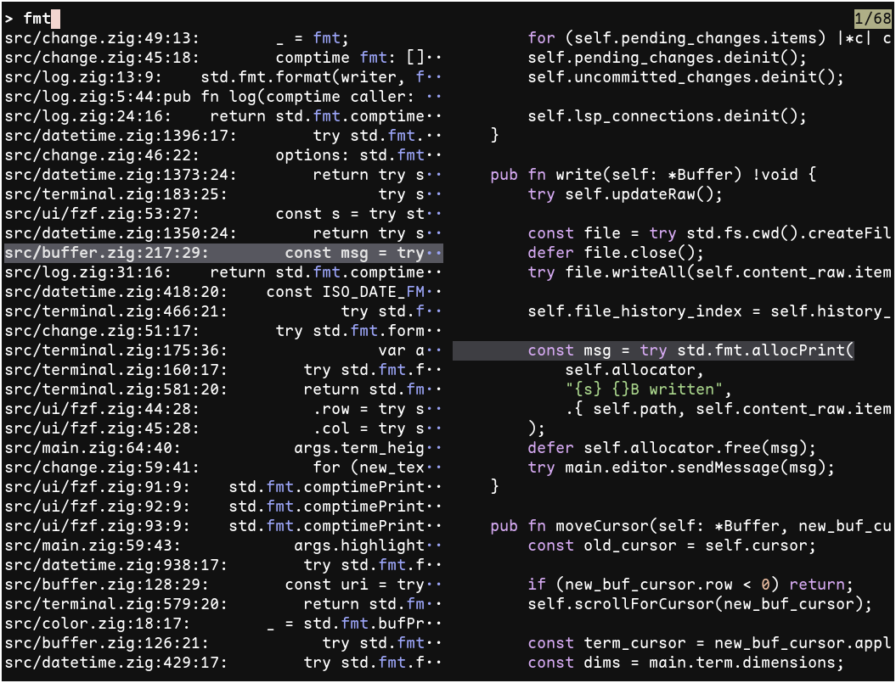
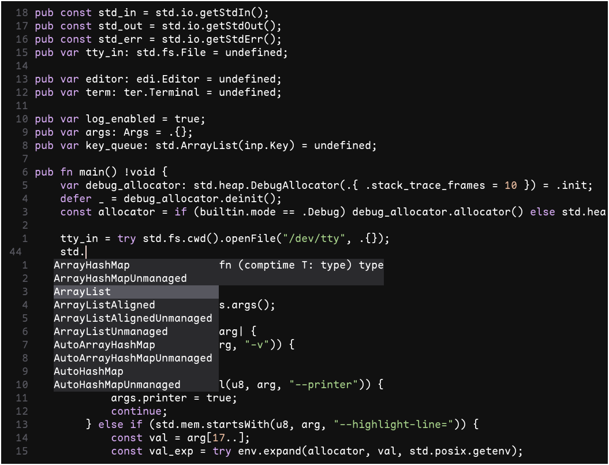
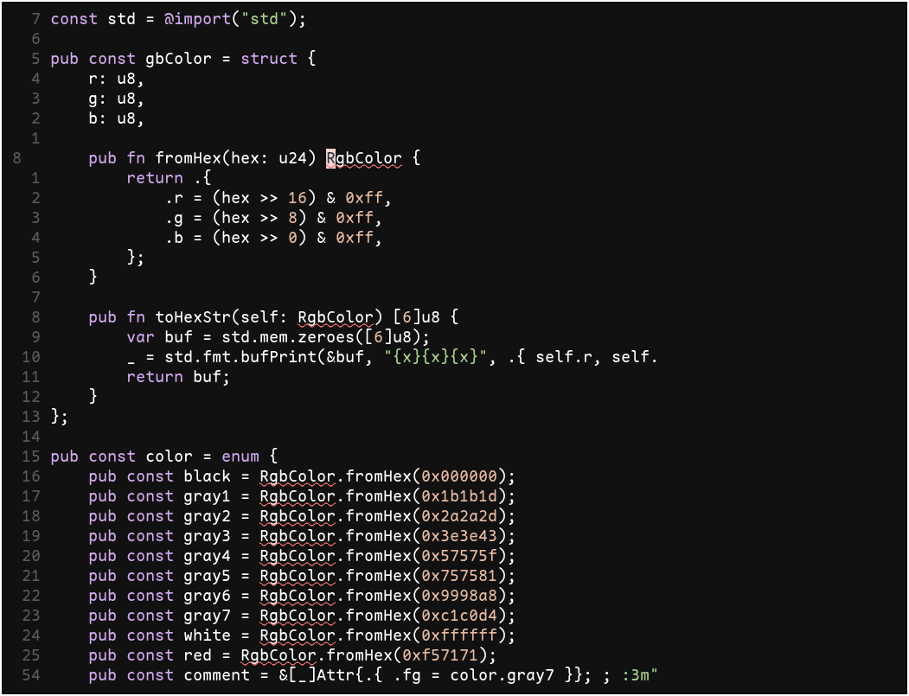

# Hat

Hat is a **ha**ckable modal **t**ext editor for modern terminals.

|  |  |
|-----------------------------|-----------------------------|
|  |  |

## Features

## Core functionality

- [x] Modal text editing
    * [x] Normal, select, select line, and insert modes
    * [x] Unlimited undo/redo
    * [x] System clipboard copy & paste (using `xclip`)
    * [x] Find in buffer
- [x] Text automation
    * [x] Run external command on selection
    * [x] Dot repeat last change
    * [x] Multi repeat
    * [x] Macros
- [x] [Tree-sitter](https://tree-sitter.github.io/tree-sitter/) syntax awareness
    * [x] Syntax highlighting (24 bit color)
    * [x] Indent alignment
- [x] [LSP](https://microsoft.github.io/language-server-protocol/) support
    * [x] Go to definition
    * [x] Find references
    * [x] Diagnostics
    * [x] Completions w/ documentation
    * [x] Hover
    * [x] Rename
- [x] Multi buffer
    * [x] Buffer management
    * [x] Find file
    * [x] Find in files
- [x] Scratch buffers
- [x] Unicode support
- [x] `--printer` mode

## Functionality available in patches

| Done | Name                      | Link                                                  | Branch                                                            |
| ---- | ------------------------  | ----------------------------------------------------- | ----------------------------------------------------------------- |
| 🚧   | Windows support           |                                                       |                                                                   |
| 🚧   | MacOS support             |                                                       |                                                                   |
| 🚧   | LSP highlight             |                                                       |                                                                   |
| 🚧   | LSP code action           |                                                       |                                                                   |
| 🚧   | LSP formatting            |                                                       |                                                                   |
| 🚧   | Persistent undo           |                                                       |                                                                   |
| 🚧   | Persistent macros         |                                                       |                                                                   |
| ✔️   | Git hunk markers          | [patch/git-signs](/patch/git-signs)                   | [link](https://github.com/ivanjermakov/hat/tree/git-signs)        |
| ✔️   | Tree-sitter symbol picker | [patch/ts-symbol-picker](/patch/ts-symbol-picker)     | [link](https://github.com/ivanjermakov/hat/tree/ts-symbol-picker) |
| 🚧   | Tree-sitter tree actions  |                                                       |                                                                   |
| ✔️   | Buffer centering          | [patch/buffer-centering](/patch/buffer-centering)     | [link](https://github.com/ivanjermakov/hat/tree/buffer-centering) |
| ✔️   | Autosave                  | [patch/autosave](/patch/autosave)                     | [link](https://github.com/ivanjermakov/hat/tree/autosave)         |

## Philosophy

- Based on [suckless](https://suckless.org/philosophy/) and
[unix](https://en.wikipedia.org/wiki/Unix_philosophy) philosophies
- Software should do not more and not less than what the user needs
    * Every feature is implemented in the most simple and straightforward form: keep it simple, fast, and clear
- Software is made for users capable of reading and customizing its source code
    * Source code can be read by users in one evening
    * External configuration is not necessary and discouraged
    * User manual documentation is not necessary, _hacking_ documentation is encouraged (via [HACKING.md](HACKING.md))
- Software is distributed as source code, compiled by the user
- Software is not meant to be developed forever and its final state should be described by its feature set from
the beginning
- Software is extended either by the user directly or by applying
[source code patches](https://en.wikipedia.org/wiki/Patch_(computing)#Source_code_patching), distributed as diff files
    * It is encouraged to share your extensions with others who can find it useful

## Install

Hat should work out of the box on any
[`std.posix`-compliant](https://github.com/ziglang/zig/blob/master/lib/std/posix.zig) operating system with satisfied
dependencies and correct tree-sitter configuration (see `file_type` in [file_type.zig](src/file_type.zig)).

### Dependencies

- [Zig](https://ziglang.org) (version >= `minimum_zig_version` in [build.zig.zon](build.zig.zon))
- [tree-sitter](https://tree-sitter.github.io/tree-sitter/)
- [pcre2](https://github.com/PCRE2Project/pcre2)

### Build

For development build:

```bash
zig build
```

For release build:

```bash
zig build --release=fast
```

Once built, executable can be found at `zig-out/bin`. For more info, see `zig build --help`.
